<!-- TOC -->

- [Reinforced Epidemic Control Saving Both Lives and Economy](#reinforced-epidemic-control-saving-both-lives-and-economy) 
    - [主要思想和问题](#主要思想和问题)        
      - [摘要](#摘要)        
      - [面临的一些困难](#面临的一些困难)    
    - [模型及结果](#模型及结果)        
      - [流动需求模型](#流动需求模型)        
      -  [流行病模型](#流行病模型)        
      -  [DURLECA模型](#durleca模型)            
         -  [强化学习](#强化学习)            
         -  [Flow-GNN](#flow-gnn)            
         -  [Exploration Strategies（探索策略）](#exploration-strategies探索策略)                
            -  [伪专家机制](#伪专家机制)                
            -  [Avoiding Extreme Points](#avoiding-extreme-points)        
      -  [实验结果](#实验结果)            
         -  [对照试验（Baselines，具体设置见论文）](#对照试验baselines具体设置见论文)            
         -  [实验结果](#实验结果-1)            
         -  [分析](#分析)
# Reinforced Epidemic Control Saving Both Lives and Economy
## 主要思想和问题
### 摘要
* 主要思想是：在不侵犯个人隐私的情况下，采用GNN和强化学习，根据移动位置数据分析城市不同区域之间的流动需求和感染风险，给出区域间动态的流动性配额，从而实现在控制疫情的同时，保障经济。
### 面临的一些困难
* 城市不同区域之间的流动量大且实时变化，难以锁定高风险的流动。
* 必须考虑政策的可行性，这就对政策的制订提出了更高的要求。
* 未来感染人数的增长是非凸函数，难以探索政策空间。
* 要实现控制疫情和保障经济的双目标，容易陷入局部最优。
## 模型及结果
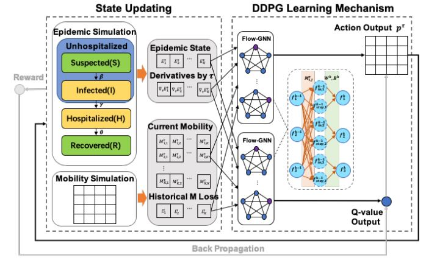
### 流动需求模型
* 矩阵$M_d^τ$为城市各区域之间在$τ$时刻的流动需求。其元素为$M_{d,i,j}^τ$,即在$τ$时刻想要从i区域到j区域的人数。
* 矩阵$p^τ$为$τ$时刻政府给出的各区域之间的流动量配额。其元素$p_{i,j}^τ$为$τ$时刻从i区域到j区域的配额比例，取值范围是[0,1]（即流动需求可以实现的比例。）
* 矩阵$M_p^τ$为城市各区域之间在$τ$时刻的实际流动量。其元素为$M_{p，i,j}^τ$,即在$τ$时刻从i区域到j区域的实际人数。其计算公式如下：
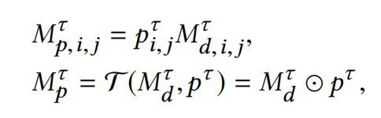
### 流行病模型
* 在SIR模型的基础上考虑收治群体（Hospitalized）提出了SIHR模型。S即易感人群；I即尚未出现症状的感染者；H即代表已经显露出症状并收治或隔离的人群；R代表痊愈人群。$E_i^τ=\{S_i^τ,I_i^τ,H_i^τ,R_i^τ\}$为$τ$时刻i区域的疫情状态。
* 每个时刻分为两个阶段：移动阶段和感染阶段。
* 移动阶段的方程为：
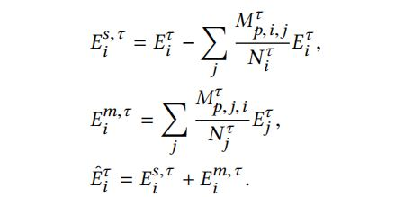
* 感染阶段：
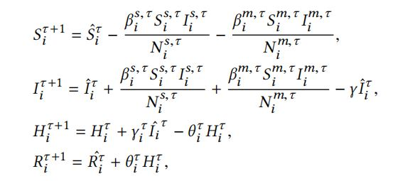

### DURLECA模型
提出了GNN-Flow以更好地模拟流动模型，并且对强化学习的反馈机制和探索策略做出了一些改变。每个时刻DURLECA模型都收到疫情状态$E_i^τ$和流动需求，强化学习部分模拟政府决策，每过4个时段根据$E_i^τ$和$\{M_d^τ,M_d^{τ+1},M_d^{τ+2},M_d^{τ+3}\}$给出控制策略$p^τ$。
#### 强化学习
给出了新的反馈机制，考虑到了一下几点：
* 反应疫情控制和流动性维持之间的平衡关系。
* 能够反映疫情传播所带来的呈指数增长的社会成本，且感染人数超过医疗系统容量后，社会成本会暴增。
* 同一地区进行长时间的持续封闭会受到惩罚。  
* reward分为两部分：疫情传播导致的社会成本和长期封锁带来的经济成本。其公式如下：
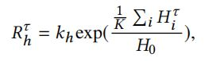
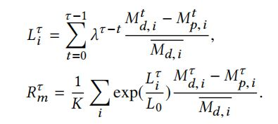
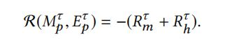
#### Flow-GNN 
* 能够适应 流动量动态变化频繁，而政府流动量控制策略较流动量变化慢的特点。即流动量每个小时都会更新，但流量控制策略每四个小时更新一次。
* 考虑上一条机制，共使用了4层Flow-GNN layers，第k层的输出如下：
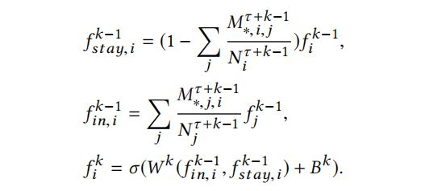
#### Exploration Strategies（探索策略）
引入了伪专家机制以及阻止模型探索明显不合理的政策空间的Avoiding Extreme Points（避免极值机制）。
##### 伪专家机制
即根据感染人数和流动量损失来决定是否封锁区域，可以在初期引导模型的训练，后期则由模型自己给出控制策略，具体操作为设置参考"专家建议"的概率，此概率会随训练的进行逐渐减小。其公式如下：
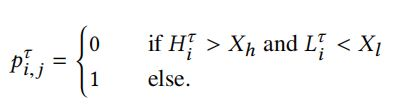
##### Avoiding Extreme Points
设置了两个阈值，一旦超过了这两个阈值，reward就会受到极大的惩罚。
* infection threshold $I_t$（感染人数阈值）
* lockdown threshold $L_t$（封锁阈值）

### 实验结果
#### 对照试验（Baselines，具体设置见论文）
* EP-Fixed：流动性固定配额（p=0.15,0.2）
* EP-Soft: $X_h=0$,$X_l=168$,即考虑对流动需求的影响，流动损失大于一定值后就会使p=1
* EP-Hard： 封锁一定时间后就必须开放
* EP-Lockdown ： 完全封锁直至疫情结束
* 设置不同的干预起始时间
* 模拟不同地区医疗资源不同的情况
#### 实验结果
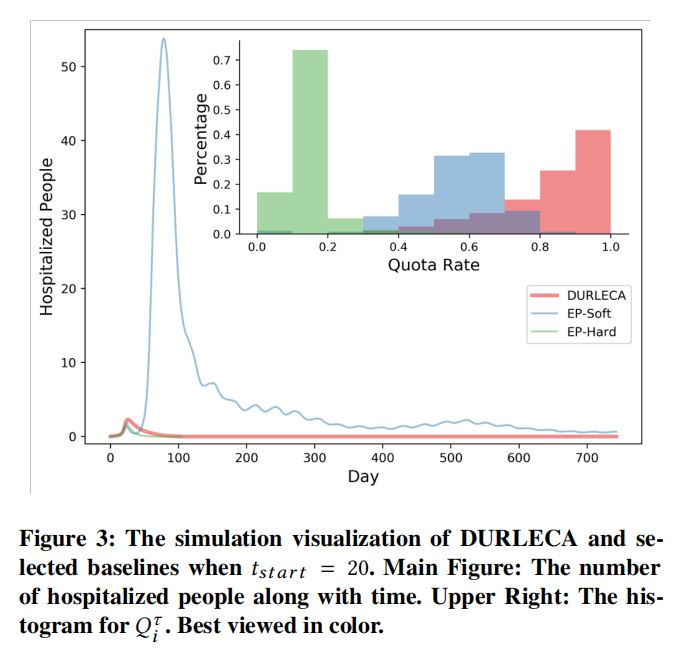
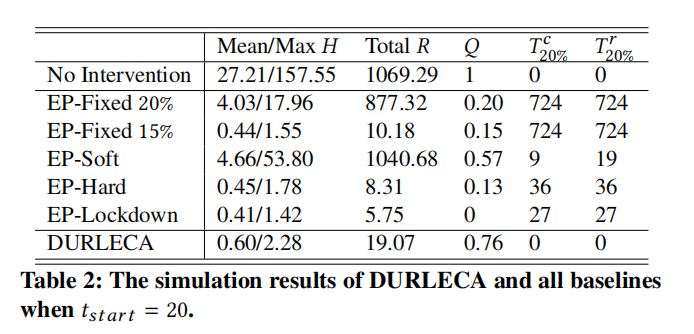
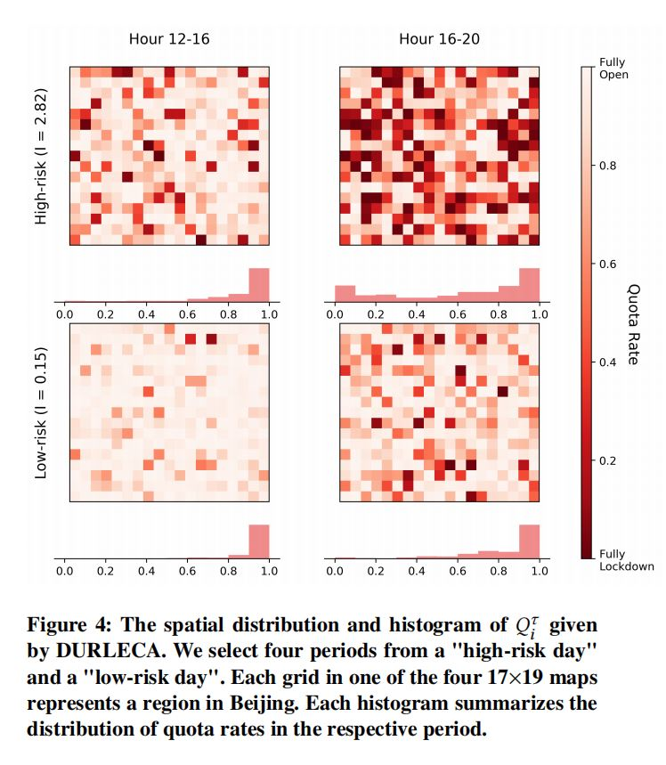
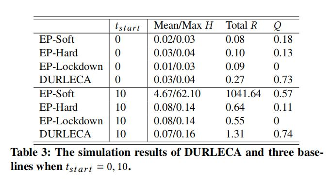
#### 分析
DURLECA给出的策略相较现在大多数国家和地区采取的完全封锁策略而言，城市的大部分区域的流动量能保持在需求的50%以上，且不会存在长期封锁的城市或区域。虽然总感染人数、每日平均收治人数和单日收治人数最大值略有超出，但处于可控范围，可根据地区的医疗资源情况进行调整。

