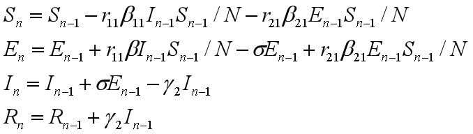
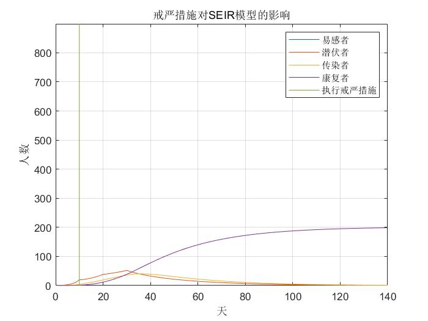

<!-- TOC -->
  - [流行病动力学模型调研报告](#流行病动力学模型调研报告)      
    - [一、引言](#一引言)      
    - [二、SEIR模型](#二seir模型)          
      - [1.一般的SEIR模型](#1一般的seir模型)          
      - [2.考虑潜伏期可传染的SEIR模型](#2考虑潜伏期可传染的seir模型)          
      - [3.在以上SEIR模型基础上考虑简单的戒严措施对疫情的影响：](#3在以上seir模型基础上考虑简单的戒严措施对疫情的影响)          
      - [4.多阶段SEIR模型](#4多阶段seir模型)          
      - [5.多阶段时滞SEIR模型(文献[2])](#5多阶段时滞seir模型文献2)      
    - [三、参数估计](#三参数估计)    

# 流行病动力学模型调研报告
## 一、引言
* 2019年12月，中国湖北省武汉市暴发了由新型人畜共患病冠状病毒（SARS-CoV-2）引发的非典型肺炎（COVID-19）。之后，疫情迅速蔓延。截至目前，国内已报告90182例感染病例和4718例死亡病例，全球报告感染超过2349万例 ，疫情严重程度远超2003年的严重急性呼吸综合征（SARS）。
* 新型冠状病毒感染的肺炎在免疫功能低下和免疫功能正常人群均可发生，与接触病毒的量有一定关系，人群普遍易感。其传播途径包括新型冠状病毒主要的传播途径还是呼吸道飞沫传播、气溶胶传播和接触传播，其中飞沫传播是指患者喷嚏、咳嗽、说话的飞沫，呼出的气体近距离直接吸入导致的感染；气溶胶传播是指飞沫混合在空气中，形成气溶胶，吸入后导致感染；接触传播是指飞沫沉积在物品表面，接触污染手后，再接触口腔、鼻腔、眼睛等黏膜，导致感染。通过流行病学调查显示，病例多可以追踪到与确诊的病例有过近距离密切接触的情况，社区传播和家庭传播的较为普遍。
* 新型冠状病毒的潜伏期为1-14天，多为3-7天。患者潜伏期亦存在一定传染性，且存在一部分无症状感染者。受到医学干预后，大部分人病情转轻，少部分病情加重，老年人或有长期基础疾病者医学干预效果较差，患者痊愈后存在一定的复阳情况。
* 本次疫情恰逢在春运期间暴发，为遏制疫情，中国于2020年1月23日开始实施前所未有的公共卫生干预策略封闭武汉的离城通道，延长了法定假日，采取了严格旅行和公共聚会限制措施，关闭了公共场所，并在全国范围内实施了健康监测。这些措施在控制病毒传播方面取得巨大成效。
本研究会在本次新冠疫情的基础上，基于SEIR（SEIRS）的优化模型，结合线上线下数据融合的方法，根据人群的移动轨迹，对SEIR模型的各项参数进行量化分析。同时在前述实验的基础上，探讨公共卫生政策对疫情防控的作用与意义。
## 二、SEIR模型
由于本次疫情中复阳情况极少，故本研究不考虑康复者复阳的情况。
### 1.一般的SEIR模型
在此类模型中，人群分为四种：易感者、潜伏者、感染者和痊愈者。个体会经历较长的潜伏期（“暴露”类别），且潜伏期内尚未具有感染力，痊愈者获得抗体不再感染病毒。此外，该模型不限制感染者的行动。模型如下图所示：

* 易感者是健康的人群，用S表示其人数；潜伏者用E表示其人数；感染者人数用I来表示；康复者人数用R表示。假设区域内的总人数为N，则N=S+E+I+R。假设每个感染者每天接触r个易感人群，有β的概率使接触者感染；潜伏者按照概率δ转化为感染者；感染者有γ的概率痊愈，则各状态转化的微分方程如下：

* 迭代方程如下：

* 通过matlab建模后的模拟结果如下：（参数参考了文献[1]给出的基础参数）

### 2.考虑潜伏期可传染的SEIR模型
* 引入潜伏者的传染概率$\beta_2$可以将健康的易感者转变为潜伏者。而潜伏者每天接触的健康易感者人数为$r_2$。则其微分方程及迭代方程为：

* 模拟结果如下图，可以看到感染人数及感染速度较原模型都有较大提高，更加符合本次疫情特点。

### 3.在以上SEIR模型基础上考虑简单的戒严措施对疫情的影响：
* 比如在第10天之后执行戒严，会使感染者和潜伏者每天接触的易感人群数$r$和$r_2$减小，则模拟结果为：

### 4.多阶段SEIR模型
* 第一阶段：20天为爆发初期，设定此时确诊感染者的传染系数为$\beta_{11}$，有效接触人数为$r_{11}$，潜伏期感染者的传染系数为$\beta_{21}$，有效接触人数为$r_{21}$，且此时缺乏有效治愈手段，故治愈率为$\gamma_1$，则此时的迭代方程为

* 第二阶段：20至30天为快速爆发期，实行紧急隔离政策，设定此时的$r_{12}$、$r_{22}$较第一阶段减小，但由于医疗物资不足感染率不变，由于医疗资源严重不足治疗率$\gamma_2$进一步下降：

* 第三阶段：30至140天为防御期，实行全面隔离政策，医疗资源紧张逐渐缓解。设定此时$r_{13}$、$r_{23}$进一步减小，感染率$\beta_{13}$、$\beta_{23}$有所下降，但治愈率$\gamma_3$有所增大。

* 仿真结果为：
  
### 5.多阶段时滞SEIR模型(文献[2])
* 由于现实中的流行病传播具有时滞性，故为了使模型更加符合实际情况，引入了时滞项建立时滞动力学模型(文献[3])
感染者出现症状前有$n_1$天的潜伏期，确诊后变成确诊感染者，经过$n_2$天的治疗观察期后变成治愈者，即$n$时刻确诊的感染者在$n-n_1$时刻成为潜伏者，并于$n+n_2$时刻痊愈。确认感染者每天接触的易感人群数为$r_1(n)$，潜伏者每天接触的易感人群数目为$r_2(n)$，两者为递减序列，其公式为(具体参数参见文献[2])：

* 此时不同阶段的迭代方程为：
* 第一阶段

* 第二阶段 

* 第三阶段 

* 仿真结果为：

## 三、参数估计
* 对于SEIR模型来说，得到合适的参数才能更好的拟合真实数据并预测疫情发展趋势。这些参数基本上都是通过对现有数据进行拟合后得到的估计值，存在一定偏差。其中治愈率、死亡率、潜伏期和治疗观察期等参数受到医疗资源、医疗水平等因素影响，难以具体量化，需要参考医学结论。
* 但感染者和潜伏者每天接触的易感人群数，以及易感人群接触病毒携带者后被感染的概率可以通过分析人群的位置和移动轨迹来进行量化。主要思路是从移动互联网流量数据中提取病毒携带者的移动位置和移动轨迹，从而得到病毒携带者每天接触的人数，还可以根据接触者感染的人数得出感染概率。此外，根据病毒携带者的位置信息划分出高风险、中风险和低风险区域，使模型更加贴近现实。
